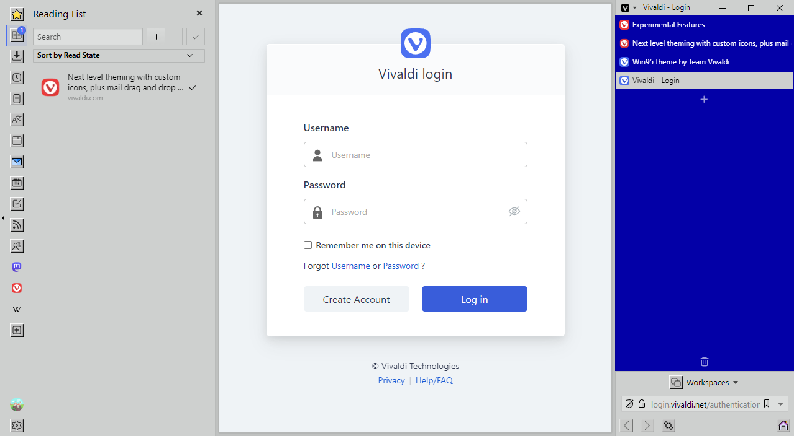

# Vivaldi VH

Vivaldi VH is a CSS modification for [Vivaldi Browser](https://vivaldi.com) that grants your webpages the entire vertical space of the browser window by moving the rest of the UI into _the Pillar_.

## Features

- Adapts to any browser settings! If you move the tab bar to the right, so will the Pillar!
- Customize the look and feel of Vivaldi VH right in the browser with [Command Chain Flags](./documentation/command-chain-flags.md) and [Command Chain Utilities](/documentation/command-chain-utilities.md)!

## Usage Notes

Vivaldi VH will only be applied when all of the following are true:

- Tab Bar Position is set to "Left" or "Right"
- "Show Address Bar" is checked
- "Show Tab Bar" is checked

I recommend binding the "Show Tab Bar" setting to a keyboard shortcut or preparing a Command Chain that toggles this setting in case a website momentarily requires more horizontal space.

## Customizing Vivaldi VH

The look and feel of Vivaldi VH can be customized through [Command Chain Flags](/documentation/command-chain-flags.md) and [Command Chain Utilities](/documentation/command-chain-utilities.md) without having to modify any CSS code.

For example, to disable the border around webpages:

1. [Create a Command Chain](https://help.vivaldi.com/desktop/shortcuts/command-chains/#Create_a_Command_Chain) with the name `vvh-disable-webpage-permanent-padding`.
2. [Open the Toolbar Editor](https://help.vivaldi.com/desktop/appearance-customization/edit-toolbars/#Customize_toolbars) and select "Command Chains" from the dropdown. Grab your created Command Chain and drag it into one of your toolbars.

## Roadmap

Vivaldi VH will be updated regularly to ensure compatibility with the latest stable version of Vivaldi Browser. New functionality may also be added in the future.

[Click here](./documentation/roadmap.md) for more information on planned features and known issues.

## Gallery

---

Copyright (c) 2023 HKayn <https://hkayn.com>
