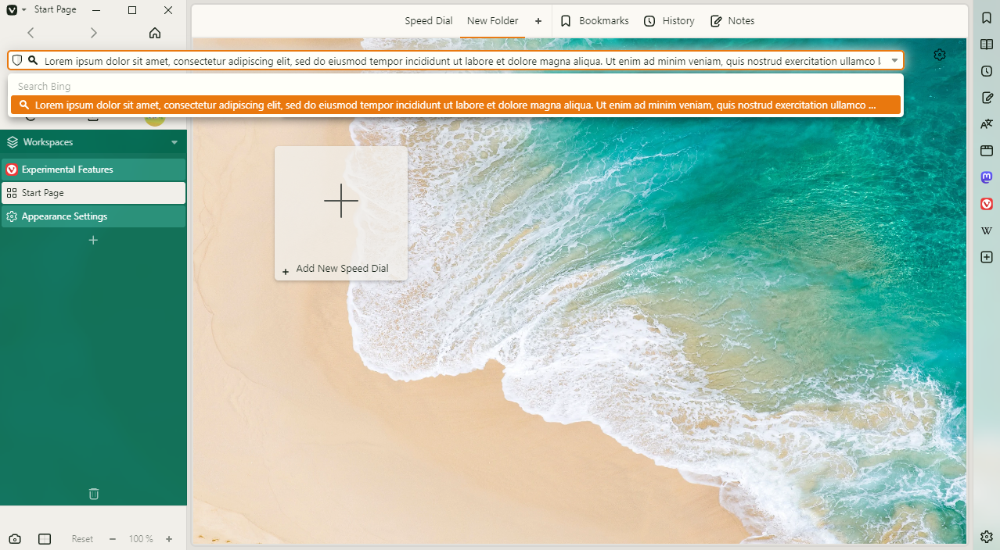

# Vivaldi VH

Vivaldi VH is a CSS modification for [Vivaldi Browser](https://vivaldi.com) that grants your webpages the entire vertical space of the browser window by moving the rest of the UI into _the Pillar_.

## Features

- Looks good on any browser settings!
- Can be customized right in the browser with [Command Chain Flags](./documentation/command-chain-flags.md)!

## Usage Notes

Vivaldi VH has a built-in failsafe to prevent it from breaking horribly when the Pillar can't be properly constructed. The presence of title bar, address bar and a vertical tab bar are currently mandatory for this.

Vivaldi VH will only activate when all of the following are true:

- Tab Bar Position is set to "Left" or "Right"
- "Show Title Bar" is checked **OR** "Menu Position" is set to "Horizontal"
- "Show Address Bar" is checked
- "Show Tab Bar" is checked

I recommend binding the "Show Tab Bar" setting to a keyboard shortcut or preparing a Command Chain that toggles this setting in case a website momentarily requires more horizontal space.

## Command Chain Flags

Command Chain Flags allow you to customize Vivaldi VH right inside Vivaldi Browser, without modifying any CSS code.

[Click here](./documentation/command-chain-flags.md) for more information.

## Roadmap

Vivaldi VH will be updated regularly to ensure compatibility with the latest stable version of Vivaldi Browser. New functionality may also be added in the future.

[Click here](./documentation/roadmap.md) for more information on planned updates and known issues.

## Gallery

Copyright (c) 2023 HKayn <https://hkayn.com>
