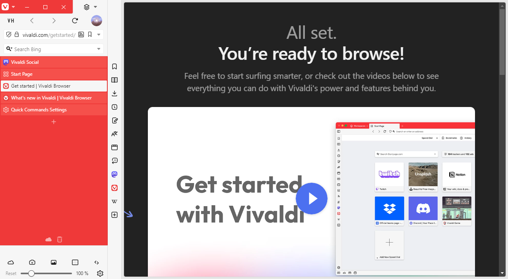

# Vivaldi VH

Vivaldi VH is a CSS modification for [Vivaldi Browser](https://vivaldi.com) that grants your webpages the entire vertical space of the browser window by moving the rest of the UI into _the Pillar_.

## Features

- Adapts to any browser settings! If you move the tab bar to the right, so will the Pillar!
- Customize the look and feel of Vivaldi VH right in the browser with [Command Chain Flags](./documentation/command-chain-flags.md) and [Command Chain Utilities](/documentation/command-chain-utilities.md)!

## Requirements

Vivaldi VH will only be active when a vertical tab bar or the panel are shown.

I recommend binding commands that change the tab bar position (e.g. "Tabs on Top" and "Tabs on Left") to keyboard shortcuts or preparing Command Chains that trigger these commands in case a website momentarily requires more horizontal space.

## Customizing Vivaldi VH

The top of the `vivaldi-vh.css` file contains custom properties that can be used to configure various aspects of Vivaldi VH.

The look and feel of Vivaldi VH can be further customized through [Command Chain Flags](/documentation/command-chain-flags.md) and [Command Chain Utilities](/documentation/command-chain-utilities.md).

For example, to disable the border around webpages:

1. [Create a Command Chain](https://help.vivaldi.com/desktop/shortcuts/command-chains/#Create_a_Command_Chain) with the name `vvh-disable-webpage-permanent-padding`.
2. [Open the Toolbar Editor](https://help.vivaldi.com/desktop/appearance-customization/edit-toolbars/#Customize_toolbars) and select "Command Chains" from the dropdown. Grab your created Command Chain and drag it into one of your toolbars.

Additionally, there is an alternative edition of Vivaldi VH for users of the [VivalArc CSS modification by tovi](https://arc.tovi.fun). Read more [here](documentation/editions.md).

## Roadmap

Vivaldi VH will be updated regularly to ensure compatibility with the latest stable version of Vivaldi Browser. New functionality may also be added in the future.

[Click here](./documentation/roadmap.md) for more information on planned features and known issues.

## Gallery

---

Copyright (c) 2023-2024 HKayn <https://hkayn.com>
