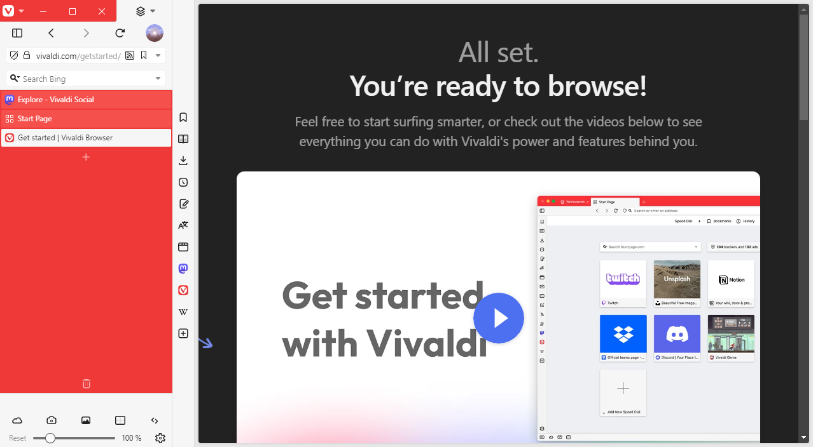
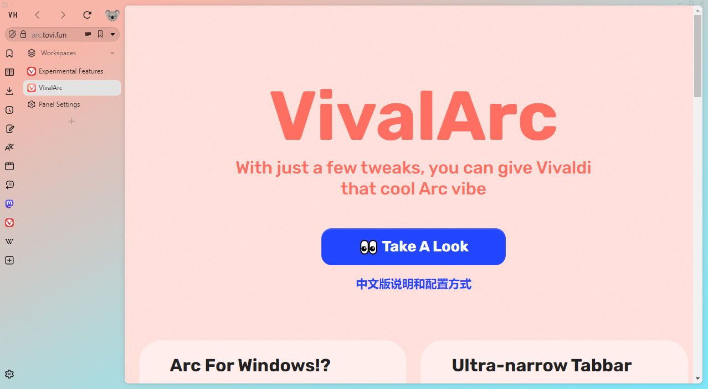

# Editions

See below for each available edition of Vivaldi VH.

## Vivaldi VH

Available as `vivaldi-vh.css`.

The default edition of Vivaldi VH, created with the intent of preserving the original aesthetic of the browser UI and changing just enough to fit all UI elements into a Pillar to the side of the webpage.

## Vivaldi VH VivalArc Edition

Available as `vivaldi-vh-vivalarc.css`.

This edition of Vivaldi VH is designed to be used in combination with the [VivalArc CSS modification by tovi](https://arc.tovi.fun). Some functionality may be missing or changed compared to the default edition.
